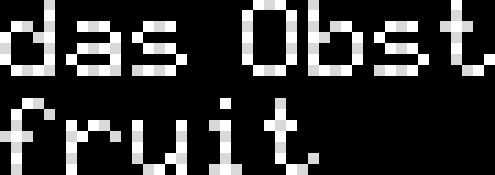

# LED matrix vocabulary learning assistant
DMD Freetronics LED Dot Matrix Display Panel 32x16 used to display random words in German along with their English translations to act as a visual learning aid to improve vocabulary.
Example:



## Version 0.1: Arduino Uno
- The words are stored in the Arduino Uno are randomly selected to be displayed.
- Arduino Uno runs out of memory after a certain number of words. (In my implementation works fine till about 40 words).

## Version 1.0 ESP32 master + Arduino Uno slave
- The words are stored in a MariaDB database hosted in a Apache server. (All part of XAMPP web server solution stack)
- ESP32 fetches the words from the database and sends it to the Arduino via I2C.

	SQL query to fetch words in a .php file
```php
$sql = "SELECT * FROM vocabulary ORDER BY RAND() LIMIT 1";
$result = $conn->query($sql);

if ($result->num_rows > 0) {
    $row = $result->fetch_assoc();
    echo json_encode($row);
} 
else 
{
    echo json_encode(array("message" => "No data found"));
}
```
- Arduino Uno recieves the words and displays it in the LED Matrix.